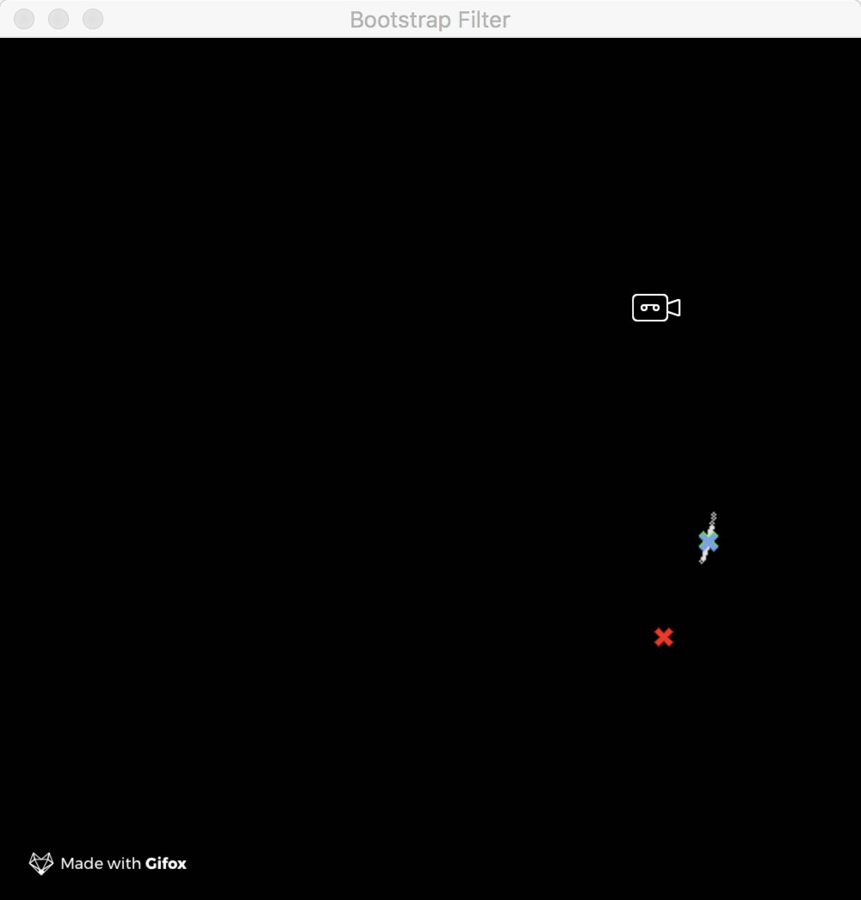

# go-estimate-examples

[](https://godoc.org/github.com/milosgajdos/go-estimate-examples)
[](https://opensource.org/licenses/Apache-2.0)

This repo contains examples of usage for [go-estimate](https://github.com/milosgajdos/go-estimate)

First, you need to install [GoCV](https://gocv.io) as instructed [here](https://github.com/hybridgroup/gocv/#how-to-install).

You can build the examples by running the following command:
```shell
$ make examples
```

Get the repo:
```shell
go get github.com/milosgajdos/go-estimate-examples
```

Build examples:
```shell
make build
```

This will create a subdirectory in each of the examples directory called `_build` and place the built binaries into it. You can run the programs by executing any of the binaries.

Alternatively, you can also install the examples by either running `go install` for each of the examples or do it all with one command:
```shell
$ make install
```

Most of the examples are static i.e. they generate a simple plot which shows how the filter estimates new values from noisy measurements.

There are however [two](bfgocv) [examples](kfgocv) which use the wonderful [gocv](https://gocv.io/) library to generate short interactive videos to watch the filters live in action.

Example of bootstrap filter in action:


